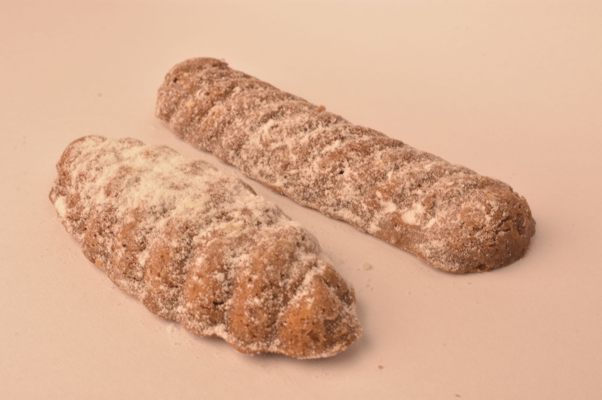

### Kakaové pracny (Medvědí tlapky)

- 230 g hladké mouky 
- 180 g tuku (používám Heru)
- 120 g cukru moučka
- 90 g mletých/sekaných vlašských ořechů 
- 2 lžíce kakaa
- skořice, citr.kůra podle chuti

<!-- Ingredient Adjuster -->
<label for="factor">Dávka:</label>
<input type="number" id="factor" min="0" max="5" step="0.1" value="1">
<button onclick="adjustAmounts()">Přepočítat</button>

Dáme do formiček. Těsta spíš míň než víc (během pečení nabydou). Ještě horké vyklopíme. Pocukrujeme moučkovým cukrem. 

Pokud se bojíte, že nepůjdou dobře vyndavat z forem, můžete formičky trochu vytřít tukem. Když pak vezmete kousek těsta, vyválejte ho do kuličky nebo válečku a jednou stranu namočte do hladké mouky. Tou pomoučenou stranou pak vtlačte do formičky. 

  
 
Zpátky do [MENU](../index)
