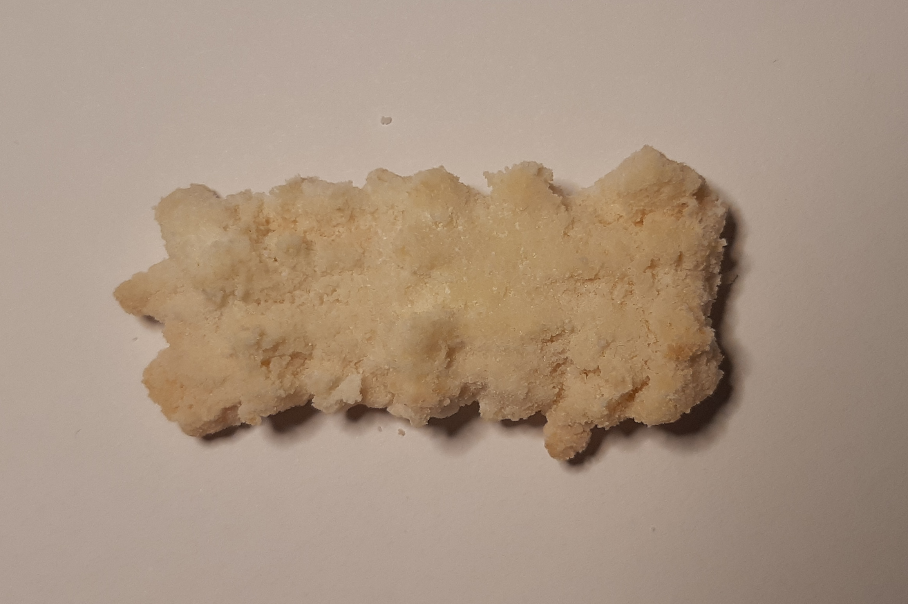

### Kokosové do strojku

- 500 g hladké mouky
- 200 g cukru
- 250 g másla
- 250 g strouhaného kokosu
- 2 vejce
- 1 vanilkový cukr

Všechny suroviny smícháme. Těsto dáme to strojku a tvarujeme cukroví.

Ještě teplé po upečení obalujeme v práškové cukru, který je smíchaný s vanilkovým cukrem.

 

Zpátky do [MENU](../index)
