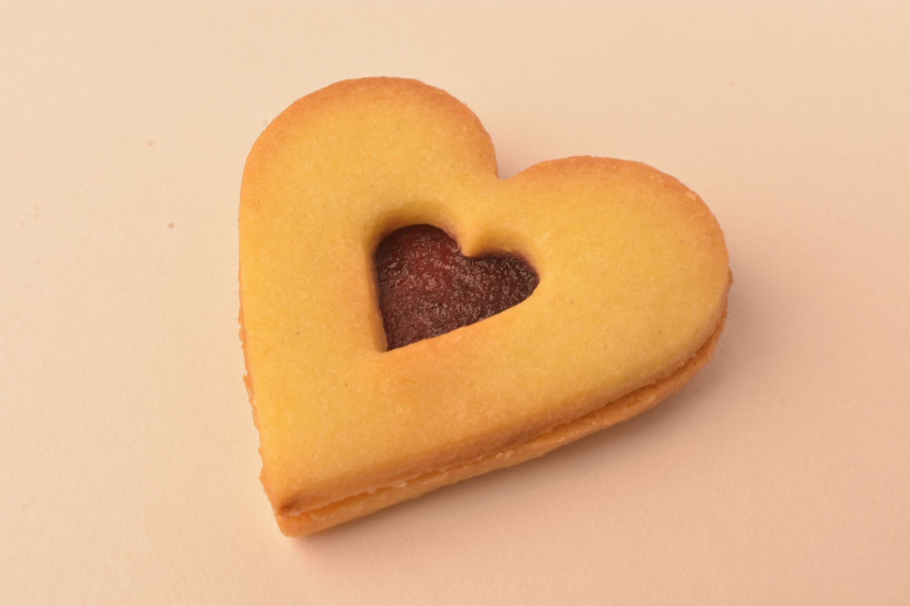
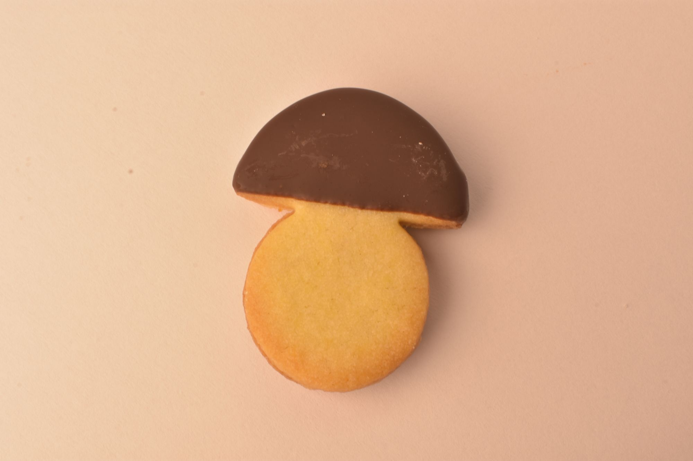
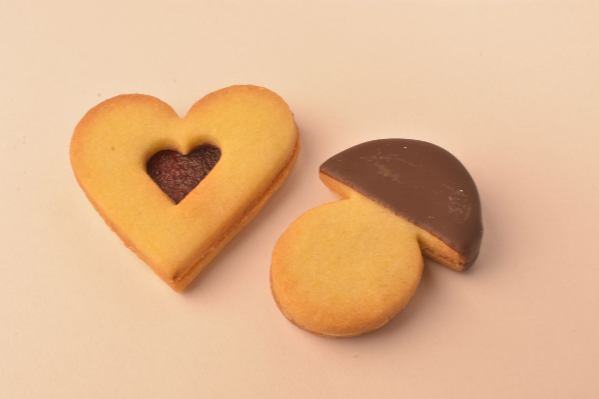

### Linecké těsto

- 210 g hladké mouky 
- 70 g cukru moučka
- 140 g másla
- 2 žloutky
- citronová kůra

<!-- Ingredient Adjuster -->
<label for="factor">Dávka:</label>
<input type="number" id="factor" min="0" max="5" step="0.1" value="1">
<button onclick="adjustAmounts()">Přepočítat</button>

Těsto lze použít buď na klasické linecké cukroví, nebo se z něj mohou dělat košíčky pro [ořechové košíčky](orechove_kosicky) nebo z něj lze udělat hvězdičky pro [kokosové hvězdičky](kokosove_hvezdicky).

Zpátky do [MENU](../index)
