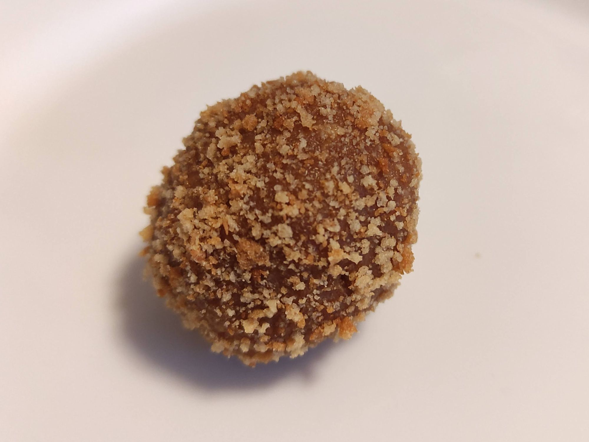

### Medovníkové kuličky

Upečeme těsto a připravíme náplň jako na [medovníčky](medovnicky).

Vychladlé korpusy nameleme najemno. Většinu namletých korpusů přidáme k náplni a z hmoty tvarujeme malé kuličky. Ty pak obalíme ve zbylém namletém korpusu.

Zpátku do [MENU](../index)
