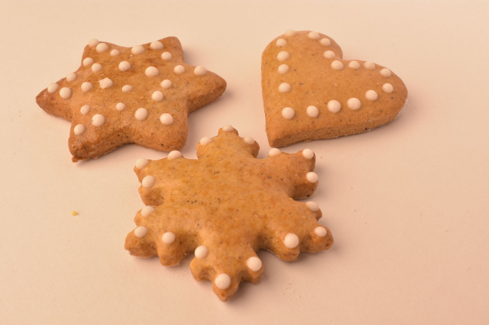

### Perníčky

- 400 g hladké mouky
- 75 g Hery
- 2 vejce
- 140 g cukru moučka
- 2 lžíce medu
- 1 káv. lžička jedlé sody 
- ½ káv. lžičky skořice
- perníkové koření

<!-- Ingredient Adjuster -->
<label for="factor">Dávka:</label>
<input type="number" id="factor" min="0" max="5" step="0.1" value="1">
<button onclick="adjustAmounts()">Přepočítat</button>

Uděláme těsto, vyválíme, vykrojíme tvary. Necháme do druhého dne odležet. Poté upečeme. Hned po vytažení z trouby můžeme perníčky potřít rozšlehaným vejcem.

Zpátky do [MENU](../index)
