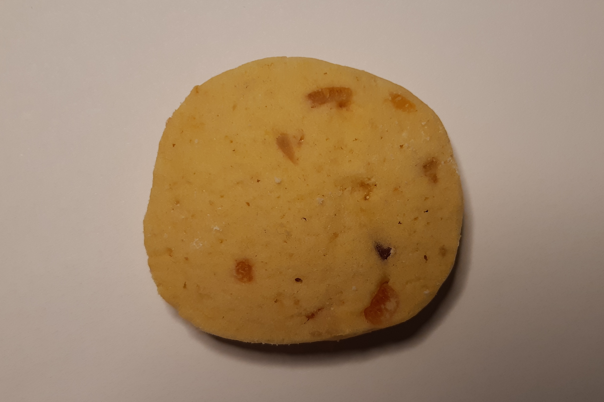

### S kandovaným ovocem

- 2 šálky hladké mouky
- 250 g másla/hery
- 1/2 šálku cukru (asi moučka)
- 2 žloutky
- 1 vanilkový cukr
- citrónová kůra
- 100g kandovaného ovoce dle chuti

Všechny suroviny krom kandovaného ovoce smícháme a uhněteme z nich těsto. 

Poté jsou dvě varianty, jaké cukroví lze dělat:
a) Pokud máme kandované např. kousky citrusů, zamícháme je do těsta a to necháme chvíli odležet v chladu. 
Pak z něj tvarujeme válečky nebo kvádry, zabalímo do potravinářské fólie a dáme na pár minut do mrazáku. 
Nakonec nakrájíme na plátky (0.5 cm) a pečeme. Tato varianta je na fotce

b) Pokud máme kandované třešně, do těsta je přidávat nebudeme. Těsto necháme chvíli v chladu odležet, poté z něj válíme kuličky, ty rozplácneme a do středu uděláme důlek. 
Do důlku pak dáme polovinu kandované třešně a upečme

 

Zpátky do [MENU](../index)
