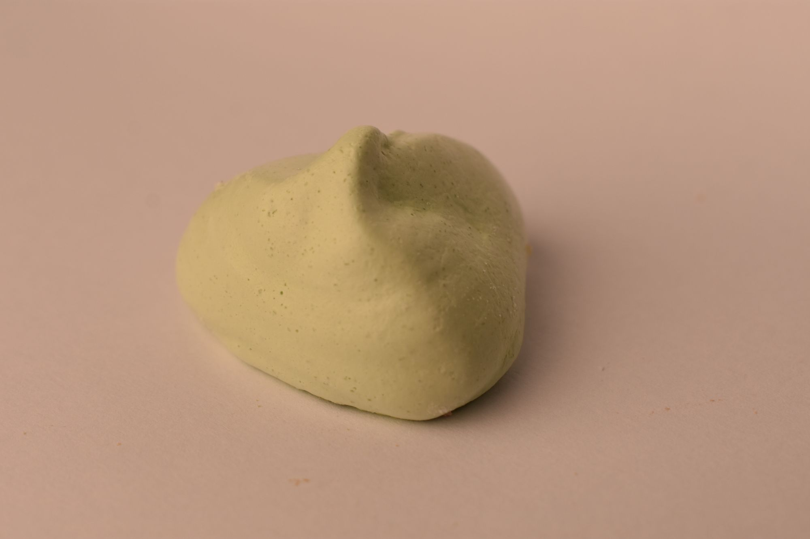

### Sněhové pusinky

- 2 bílky 
- 100 g cukru krupice
- příp. potravinářské barvivo

<!-- Ingredient Adjuster -->
<label for="factor">Dávka:</label>
<input type="number" id="factor" min="0" max="5" step="0.1" value="1">
<button onclick="adjustAmounts()">Přepočítat</button>

Začneme šlehat samotné bílky a postupně přidáváme a zašleháváme cukr. Šleháme tak dlouho, dokud není sníh dostatečně pevný a tvoří tzv. špičky. Nakonec je možné sníh obarvit potravinářským barvivem (nejlépe gelovým). 

Pomocí cukrářského sáčku tvoříme malé pusinky na pečící papír a pak dáme péct do trouby vyhřáté na 100° C asi na hodinu. Poté troubu vypneme a nechám v ní plech až do úplného vychladnutí (nejlépe přes noc).

Zpátky do [MENU](../index)

