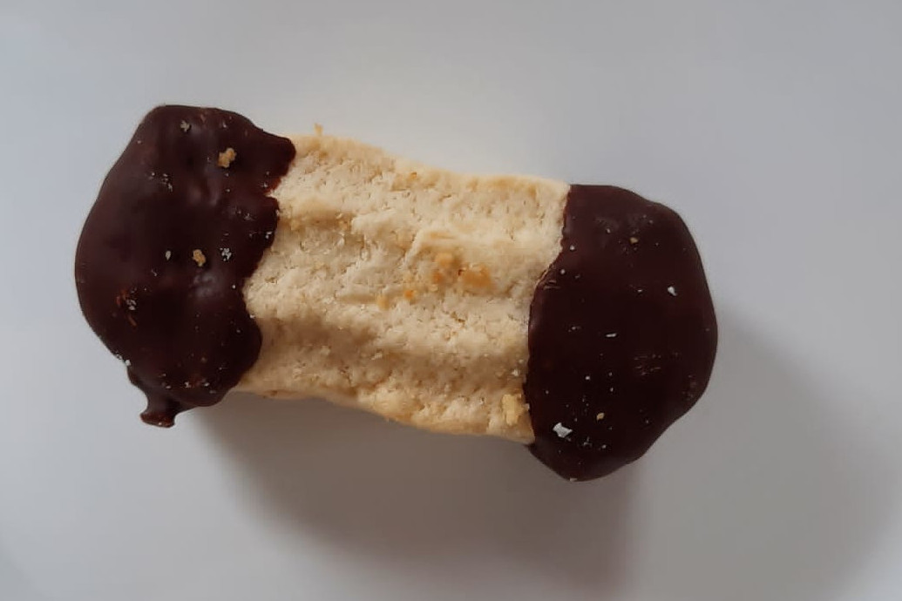

### Třené do strojku

- 600 g hladké mouky
- 500 g másla/hery
- 100 g cukru
- 2 vejce
- 1 vanilkový cukr
- citrónová kůra

Všechny suroviny smícháme. Těsto dáme to strojku a tvarujeme cukroví.

Po vychladnutí slepujeme marmeládou a namáčíme konce o čokolády

 

Zpátky do [MENU](../index)
