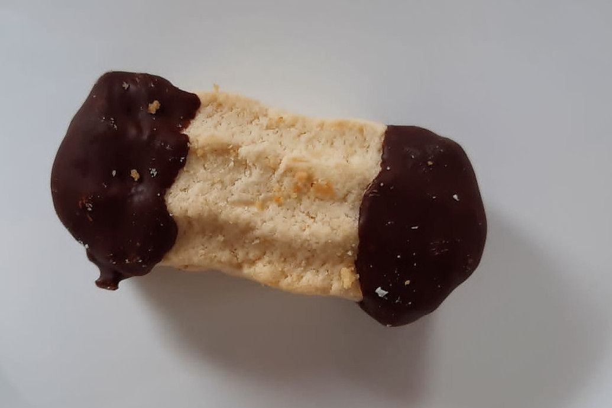

### Třené do strojku

- 600 g hladké mouky
- 500 g másla/hery
- 100 g cukru
- 2 vejce
- 1 vanilkový cukr
- citrónová kůra

<!-- Ingredient Adjuster -->
<label for="factor">Dávka:</label>
<input type="number" id="factor" min="0" max="5" step="0.1" value="1">
<button onclick="adjustAmounts()">Přepočítat</button>

Všechny suroviny smícháme. Těsto dáme to strojku a tvarujeme cukroví.

Po vychladnutí slepujeme marmeládou a namáčíme konce o čokolády

 

Zpátky do [MENU](../index)
