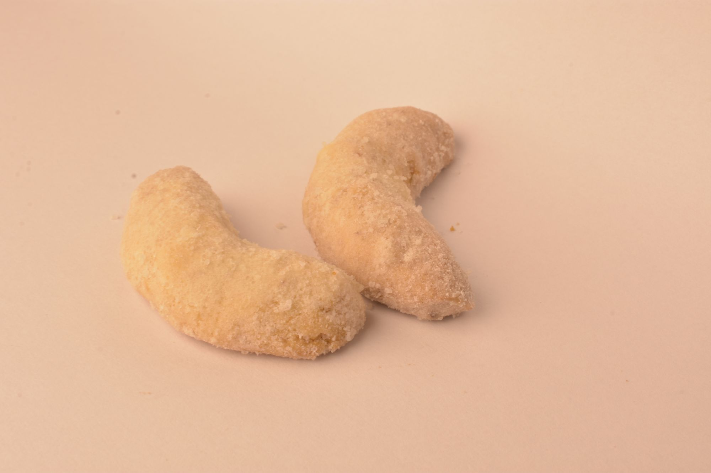

### Vanilkové rohlíčky

- 250 g hladké mouky
- 150 g másla (příp. Hery pro veganskou verzi)
- 70 g cukru moučka
- 100 g mletých ořechů

<!-- Ingredient Adjuster -->
<label for="factor">Dávka:</label>
<input type="number" id="factor" min="0" max="5" step="0.1" value="1">
<button onclick="adjustAmounts()">Přepočítat</button>

Vypracujeme těsto, tvarujeme rohlíčky. Ještě teplé po upečení je obalujeme v práškové cukru, který je smíchaný s vanilkovým cukrem.

Zpátku do [MENU](../index)
