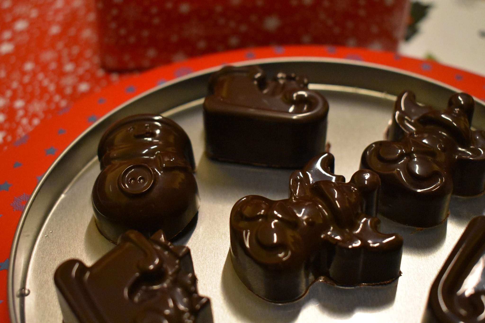

### Vánoční pralinky

- 72% hořká čokoláda
- marcipán
- vhodná forma na pralinky

Čokoládu temperujeme ve vodní lázni podle návody u konkrétní čokolády. V tomto případě to bylo 48/50°C -> 28°C -> 30/32°C. Poté dáme menší množství čokolády do formičky a potravinářským štetcem rozetřeme do všech částí formičky. Když máme ve všech formičkách trochu čokolády, několikrát s formičkou praštíme o stůl/linku, aby se odstranily všechny bublinky a dáme na chvíli do chladu. 

Z marcipánu tvoříme jednoduché tvary, které vtlačíme do připravených polo-pralinek. Nakonec doplníme temperovanou čokoládu tak, aby byla formička celá plná a opět několikrát bouchneme o linku, aby se uvolnli bublinky. Nakonec necháme přes noc zatuhnout v chladu a pak vyklopíme. 

Zpátku do [MENU](../index)

